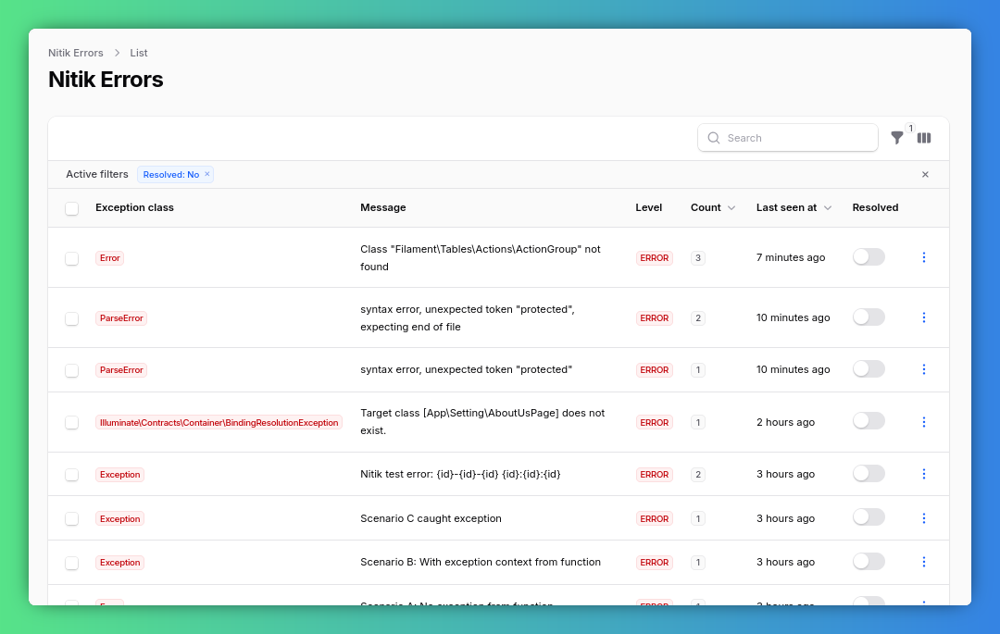

# Nitik



Nitik is a robust error tracking package for Laravel and Filament. It aggregates unique errors into a database and provides a sleek dashboard to manage them.

## Features

- **Unique Error Aggregation**: Combines similar errors into a single record with a count of occurrences.
- **Smart Stack Trace**: Captures and filters stack traces for better readability, skipping internal baggage.
- **Filament Integration**: Comes with a ready-to-use Filament resource to monitor and manage errors.
- **Infinite Loop Protection**: Prevents recursive logging loops if the database or driver fails.

## Requirements

- PHP: `^8.1`
- Laravel: `^10.0 | ^11.0 | ^12.0`
- Filament: `^4.0 | ^5.0`

## Installation

```bash
composer require kholil/nitik
php artisan migrate
```

## Configuration

### 1. Publish Config

```bash
php artisan vendor:publish --tag=nitik-config
```

### 2. Add Log Channel

Add the `nitik` channel to your `config/logging.php`:

```php
'channels' => [
    'stack' => [
        'driver' => 'stack',
        'channels' => ['single', 'nitik'],
        'ignore_exceptions' => false,
    ],

    'nitik' => [
        'driver' => 'nitik',
        'level' => 'debug',
    ],
    // ...
],
```

### 3. Register Filament Plugin

Add the `NitikPlugin` to your Filament Panel Provider:

```php
use Kholil\Nitik\NitikPlugin;

public function panel(Panel $panel): Panel
{
    return $panel
        // ...
        ->plugins([
            NitikPlugin::make(),
        ]);
}
```

## Artisan Commands

Clean up your error records periodically using these commands:

### Clear Resolved Errors
Hapus semua error yang sudah ditandai sebagai 'Resolved'.
```bash
php artisan nitik:clear-resolved
```

### Prune Old Errors
Hapus error lama berdasarkan jumlah hari (default: 30 hari).
```bash
php artisan nitik:prune --days=30
```

## Configuration Options

Edit `config/nitik.php` to customize behavior:

- `log_levels`: Array of levels (e.g., `error`, `critical`) to capture.
- `ignore_exceptions`: List of exception classes to skip (e.g., `NotFoundHttpException`).

## License

The MIT License (MIT). Please see [License File](LICENSE.md) for more information.
